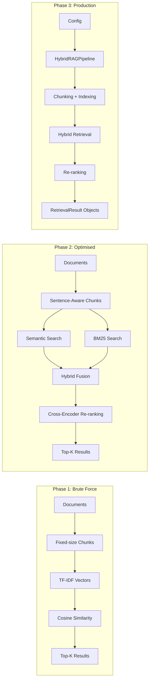

# RAG Eval Toolkit

Production RAG patterns built from scratch — hybrid retrieval, evaluation, and context engineering.

I've built production RAG systems serving 2,500+ engineers. This repo implements those patterns from the ground up, showing the progression from naive approaches to production-grade pipelines.

## Architecture



Each phase is self-contained and runnable. The progression shows why naive approaches break and how production systems solve those problems.

## Quick Start

```bash
git clone https://github.com/ianimash/rag-eval-toolkit.git
cd rag-eval-toolkit
pip install -e ".[dev]"
python examples/demo.py
```

## What's Inside

### Phase 1: Brute Force (`src/retrieval/phase1_bruteforce.py`)
- Load documents with plain Python
- Fixed-size character chunking (see where it breaks)
- TF-IDF vectors from scratch (just `collections.Counter` and `math`)
- Cosine similarity by hand
- **Limitation:** No semantic understanding. Keyword-only matching.

### Phase 2: Optimised (`src/retrieval/phase2_hybrid.py`)
- Sentence-aware chunking with overlap
- Semantic search via `sentence-transformers` embeddings
- BM25 keyword search via `rank-bm25`
- Hybrid scoring (weighted fusion of semantic + BM25)
- Cross-encoder re-ranking for higher accuracy
- **Result:** Dramatically better retrieval quality.

### Phase 3: Production (`src/retrieval/phase3_production.py`)
- Configuration via dataclass (`RAGConfig`)
- Clean public API (`HybridRAGPipeline`)
- Proper logging, error handling, type hints
- Designed to be importable, testable, and extendable

## Running Tests

```bash
pytest tests/ -v
```

## Video

This code was built as part of [Ship It with Idriss](https://youtube.com/@ShipItWithIdriss) Episode 1: "RAG From Scratch."

Every video builds code three ways:
1. **Phase 1:** Brute force (understand the fundamentals)
2. **Phase 2:** Optimised (proper engineering patterns)
3. **Phase 3:** AI-assisted (Claude Code generates the production version)

## What's Coming Next

- **Episode 2:** LLM Evaluation Framework (DOE methodology, LLM-as-judge, statistical confidence intervals)
- **Episode 3:** Context Engineering (the 7 components that ship AI to production)
- **Episode 5:** Hybrid RAG Deep Dive (MMR diversification, entitlement filtering, 6 segmentation strategies)

## License

MIT
